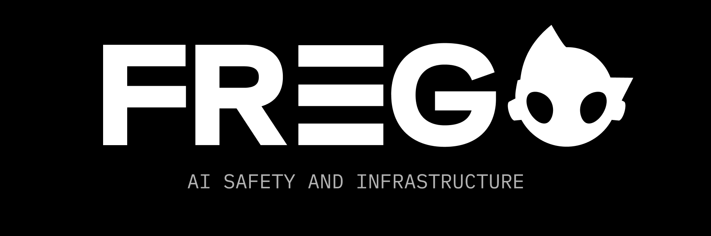

# FREGO Swarms Bridge
> Cross-chain agentic swarms data feed and interaction

FREGO Swarms Bridge is a language-agnostic, cross-chain data connector enabling seamless interaction with web3 swarm protocols. Designed to bridge web2 and web3 technologies, FREGO provides developers with a standardized interface to leverage the power of agentic swarm protocols like [fxn-protocol-sdk](https://github.com/Oz-Networks/fxn-protocol-sdk).

## Features
- Cross-Chain Compatibility: Interact with multiple blockchains through standardized APIs
- Real-Time Data: Access live on-chain and off-chain swarm data
- Developer Friendly: Language-agnostic design with web2 friendly APIs
- Free to Use Public Deployment: [Hosted here](https://data.frego.ai)

## Supported Protocols:
### FXN
- [fxn-protocol-sdk](https://github.com/Oz-Networks/fxn-protocol-sdk)

## Roadmap
We aim to establish FREGO Swarms Bridge as the go-to interface for agentic swarm data interactions across chains. Our focus is on enhancing data transparency to maximize developer ability to use, measure, and draw insights from web3 agentic swarms.

### Near-term (1-2 months)
- [X] Setup public API backend service
- [X] v1/base FXN integration
- [ ] Setup instructions and example integrations
- [ ] Clearer contribution rules
- [ ] Integrate with Frego Launchpad web3 auth service
- [ ] API key management via Frego Launchpad webapp
- [ ] API key based abstraction for FXN protocol access  
- [ ] New web2 friendly API endpoints for protocol usage

### Later
- [ ] Install via npm 
- [ ] Eliza connector
- [ ] Zerepy connector
- [ ] Swarms data agent interface
- [ ] v1/base TAO integration

### Long term
- [ ] Frontend dashboard webapp w/ auth
- [ ] Automated cross-framework risk assement

## API Documentation

Access the [Swagger API documentation](https://data.frego.ai/api-docs/) to explore available endpoints and test API requests.

## Contributing
We welcome contributions from the community! To contribute:

- Fork the repository
- Create your feature branch (git checkout -b feature/YourFeature)
- Commit your changes (git commit -m 'Made a cool new feature')
- Push to the branch (git push origin feature/YourFeature)
- Open a Pull Request

## License
This project is licensed under the MIT License - see the LICENSE file for details.

## Support
- [Links page](https://links.frego.ai)
